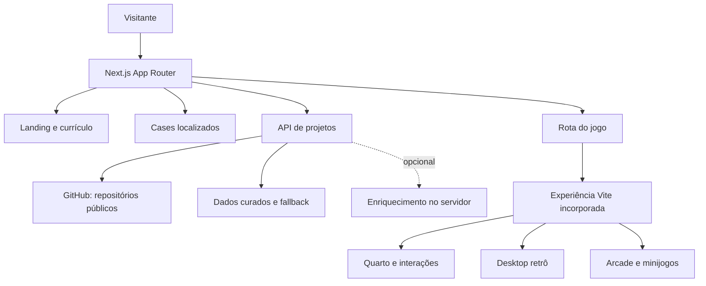

<div align="center">

# charlles.dev

**Portfólio full stack, laboratório visual e um pequeno mundo jogável no mesmo endereço.**

[Portfólio](https://charlles.dev) · [GitHub](https://github.com/charlles-dev) · [LinkedIn](https://www.linkedin.com/in/charlles-augusto/) · [E-mail](mailto:hello@charlles.dev)

</div>


## O que é este projeto

Este repositório sustenta minha presença profissional na web. A landing apresenta quem eu sou, o que construo e como trabalho; os cases aprofundam decisões técnicas; o currículo organiza a trajetória; e **Entre Camadas** transforma parte do portfólio em uma experiência jogável.

Não é um template. Cada parte tem uma função:

- apresentar projetos públicos com contexto, não apenas cards;
- ligar tecnologias a evidências reais de uso;
- oferecer conteúdo em português, inglês e espanhol;
- manter contato, currículo e cases acessíveis sem depender do jogo;
- usar motion, vídeo e personagem como linguagem da experiência;
- recompensar quem explora com uma casa interativa, um computador retrô e minijogos.

## Experiências principais

### Portfólio

- Hero cinematográfica com identidade própria e vídeo adaptativo.
- Trabalhos públicos organizados por categoria e alimentados pelo GitHub.
- Experiência, educação, certificações e stack em seções editoriais.
- Contato por e-mail, WhatsApp e Cal.com.
- Atalhos de teclado, menu contextual próprio e pequenos easter eggs.
- Motion com GSAP, respeitando `prefers-reduced-motion`.

### Cases e currículo

Os cases podem registrar problema, contexto, responsabilidades, arquitetura, trade-offs, limitações e resultado. A landing apresenta o recorte; o case comprova a implementação.

O currículo reutiliza os mesmos dados profissionais do portfólio e foi preparado para leitura, impressão e PDF. Assim, trajetória, stack e contatos não precisam ser mantidos em duas versões conflitantes.

### Entre Camadas

O jogo existe dentro do portfólio, mas tem identidade e arquitetura próprias. A experiência atual inclui:

- menu e introdução em pixel art;
- quarto explorável com teclado e toque;
- pontos de interação próximos ao personagem;
- computador inspirado em sistemas desktop dos anos 1990;
- sessões normal, administrador e uma tentativa suspeita com humor;
- Internet Explorer com busca simulada;
- bloco de notas, calculadora, pintura, câmera, arquivos e terminal;
- videogame com uma coleção de minijogos locais.

#### Minijogos

| Jogo         | Ideia                                                  | Estado               |
| ------------ | ------------------------------------------------------ | -------------------- |
| Cache Match  | Memória com progressão de fases                        | Jogável              |
| Byte Snake   | Snake compacto com teclado e toque                     | Jogável              |
| Packet Pong  | Pong com movimento contínuo e bot equilibrado          | Jogável              |
| Campo Minado | Regras conhecidas, bandeiras e primeira jogada segura  | Jogável              |
| Word Bomb    | Formar palavras com um fragmento antes do pavio acabar | Jogável e localizado |

O Word Bomb usa dicionários locais por idioma, partidas curtas, três vidas e oito acertos para vencer. Não depende de API nem envia o que a pessoa digita.

## Arquitetura



O projeto é dividido em duas aplicações:

1. **Aplicação principal:** Next.js, responsável pelo portfólio, SEO, currículo, cases, rotas experimentais do jogo e projetos públicos.
2. **Experiência 2D:** React + Vite em `game-original`, compilada para `public/game/original` e incorporada ao portfólio.

Essa fronteira permite evoluir o jogo sem transformar a landing inteira em um bundle de engine e assets.

## Tecnologias

| Camada          | Tecnologias                                 | Uso                                            |
| --------------- | ------------------------------------------- | ---------------------------------------------- |
| Aplicação       | Next.js 16, React 19, TypeScript            | Rotas, renderização, metadata e componentes    |
| Interface       | Tailwind CSS, CSS Modules, Iconify          | Layout, responsividade e sistema visual        |
| Motion          | GSAP, CSS animations                        | Scroll, entradas, microinterações e transições |
| Experimentos 3D | Babylon.js                                  | Sandbox, câmera, física e personagem GLB       |
| Jogo 2D         | React, Vite, XState                         | Mundo, desktop, estados e minijogos            |
| Idiomas         | Dicionários locais, i18next                 | PT-BR, inglês e espanhol                       |
| Dados           | GitHub API, cache e fallback curado         | Projetos públicos e atualização                |
| IA opcional     | Groq no servidor                            | Descrições públicas sem expor a chave          |
| Qualidade       | Vitest, Testing Library, Playwright, ESLint | Contratos, comportamento e regressão visual    |
| Entrega         | Vercel, GitHub Actions                      | Build, publicação e verificações               |

## Rotas relevantes

As rotas recebem o idioma na URL. Exemplos em PT-BR:

| Rota                     | Conteúdo                       |
| ------------------------ | ------------------------------ |
| `/pt-BR`                 | Portfólio principal            |
| `/pt-BR/cv`              | Currículo e impressão          |
| `/pt-BR/projects/[slug]` | Case individual                |
| `/pt-BR/game/world`      | Entre Camadas                  |
| `/pt-BR/game/sandbox`    | Sandbox 3D do personagem       |
| `/pt-BR/game/graybox`    | Laboratório mecânico           |
| `/pt-BR/game/puzzle`     | Protótipo da mecânica do Elo   |
| `/pt-BR/game/lab`        | Inspeção do modelo e animações |

As equivalentes `/en` e `/es` seguem o mesmo contrato.

## Projetos públicos

A vitrine consulta somente repositórios públicos e combina:

1. dados do GitHub, como linguagem e atualização;
2. ajustes editoriais versionados para contexto e categorias;
3. fallback local para o site continuar útil quando a API falhar.

O token do GitHub é opcional em desenvolvimento, mas aumenta o limite de requisições. Repositórios privados não devem aparecer na interface, nos fallbacks nem na documentação pública.

## Idiomas, acessibilidade e performance

O conteúdo principal e os jogos atendem português do Brasil, inglês e espanhol. A experiência considera teclado, foco visível, nomes acessíveis, contraste, áreas de toque, textos alternativos e redução de movimento. Nenhuma informação profissional essencial fica presa dentro do jogo.

Vídeos, sprites, áudio, modelos 3D e imagens são tratados como orçamento. A aplicação separa o jogo do bundle principal, carrega partes pesadas sob demanda, usa assets versionados para cache e mantém os minijogos locais.

## Desenvolvimento local

### Requisitos

- Node.js `>=22.13.0 <23`
- pnpm `>=11.21.0 <12`

```bash
git clone https://github.com/charlles-dev/charlles-dev-portfolio.git
cd charlles-dev-portfolio
pnpm install --frozen-lockfile
pnpm dev
```

Abra `http://localhost:3000`.

### Variáveis de ambiente

Copie `.env.example` para `.env.local`. O arquivo local nunca entra no Git.

| Variável                     | Obrigatória | Finalidade                                 |
| ---------------------------- | ----------- | ------------------------------------------ |
| `GITHUB_OWNER`               | Não         | Perfil consultado para projetos públicos   |
| `GITHUB_TOKEN`               | Não         | Aumenta o limite da GitHub API             |
| `PROJECTS_CACHE_TTL_SECONDS` | Não         | Controla o cache dos projetos              |
| `GROQ_API_KEY`               | Não         | Ativa enriquecimento editorial no servidor |
| `GROQ_MODEL`                 | Não         | Escolhe o modelo dessa etapa               |

Sem IA ou token, o portfólio continua funcionando com dados públicos e fallback curado.

## Trabalhando no jogo

```bash
cd game-original
npm install
npm run dev
```

`npm run build` gera a versão incorporada em `public/game/original`.

## Comandos úteis

### Aplicação principal

| Comando                 | Função                              |
| ----------------------- | ----------------------------------- |
| `pnpm dev`              | Inicia o ambiente local             |
| `pnpm lint`             | Verifica padrões de código          |
| `pnpm test`             | Executa testes e contratos          |
| `pnpm build`            | Gera a build de produção            |
| `pnpm quality`          | Executa lint, testes e build        |
| `pnpm qa:visual`        | Compara páginas e breakpoints       |
| `pnpm qa:visual:update` | Atualiza snapshots intencionalmente |

### Experiência 2D

| Comando                 | Função                               |
| ----------------------- | ------------------------------------ |
| `npm run dev`           | Inicia o jogo isoladamente           |
| `npm run lint`          | Verifica o código do jogo            |
| `npm run test`          | Executa os testes do jogo            |
| `npm run i18n:validate` | Confere as chaves nos três idiomas   |
| `npm run build`         | Atualiza a versão usada pelo Next.js |

## Qualidade e entrega

O fluxo automatizado cobre lint, testes, build, screenshots em desktop e mobile, três idiomas, rotas principais, currículo, cases e jogo. Antes de publicar:

```bash
pnpm quality
pnpm qa:visual
```

Mudanças no jogo também devem passar por testes, validação de traduções e uma nova build em `game-original`.

## Estrutura

```text
.
├── .github/workflows/        # Qualidade e regressão visual
├── game-original/            # Fonte da experiência 2D
│   ├── scripts/              # Build e validação do jogo
│   └── src/                  # Mundo, desktop, apps e arcade
├── public/
│   ├── assets/game/          # Personagem, cenários e áudio
│   └── game/original/        # Build incorporada
├── src/
│   ├── app/                  # Rotas, API, metadata e sitemap
│   ├── components/           # Landing, cases, currículo e jogos
│   ├── game/                 # Sistemas dos protótipos 3D
│   ├── lib/                  # Conteúdo, idiomas e projetos
│   └── test/                 # Testes e contratos
└── tests/                    # Cenários visuais
```

Documentos de processo, instruções locais de agentes, arquivos do Blender, caches e relatórios temporários permanecem no ambiente de trabalho, mas são ignorados pelo Git.

## Roadmap do portfólio

1. Aprofundar cases com evidências, decisões e limitações reais.
2. Consolidar conteúdo profissional em uma única fonte de dados.
3. Ligar cada tecnologia aos projetos em que resolveu um problema.
4. Medir peso de vídeo, imagem, áudio e JavaScript por rota.
5. Cobrir foco, contraste, teclado e redução de movimento em CI.
6. Refinar metadata e previews sociais por case e idioma.
7. Melhorar estados de erro e atualização do GitHub.
8. Validar aparelhos móveis modestos e navegadores reais.
9. Instrumentar métricas essenciais com privacidade.
10. Remover rotas ou fontes legadas que não sustentem mais a narrativa.

## Próxima fase de Entre Camadas

A cidade está planejada, mas não será construída antes da transição da casa estar definida:

1. transformar a porta em uma saída clara e acessível;
2. salvar o estado da sala antes da mudança de cena;
3. pré-carregar o exterior com feedback curto;
4. criar um quarteirão em graybox, com colisão, câmera e retorno;
5. validar teclado, controle e touch;
6. definir três pontos de interesse com função;
7. só então produzir rua, prédios, iluminação, NPCs e ambientação final.

Possíveis pontos de interesse:

- **Oficina:** projetos, protótipos e peças técnicas.
- **Lan house:** arcade e desafios futuros.
- **Estação:** ligação narrativa com novas regiões.
- **Café:** diálogos, colaborações e histórias curtas.

O primeiro teste deve responder: sair de casa, reconhecer um destino e voltar é gostoso de controlar? A arte final vem depois.

## Segurança e privacidade

- Segredos permanecem no servidor.
- Nenhum token usa prefixo público.
- O jogo não exige conta nem coleta palavras digitadas.
- A interface expõe apenas dados públicos selecionados do GitHub.
- `.env.local`, caches, builds locais e relatórios não entram no Git.

## Contato

Sou **Charlles Augusto**, engenheiro de software full stack. Para conversar sobre projeto, oportunidade ou alguma decisão técnica deste repositório:

- [hello@charlles.dev](mailto:hello@charlles.dev)
- [LinkedIn](https://www.linkedin.com/in/charlles-augusto/)
- [GitHub](https://github.com/charlles-dev)

Se você chegou até aqui pelo jogo: sim, o computador ainda tem coisas escondidas.
