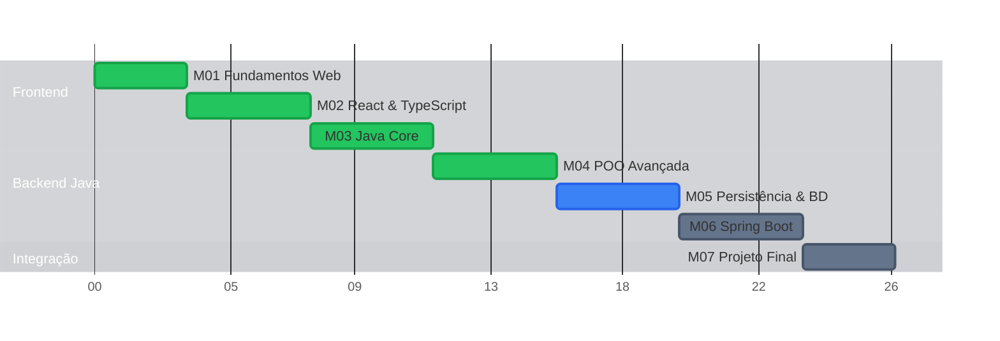

# charlles-dev/Astrolink

# Astrolink

Astrolink vende e gerencia acesso Wi-Fi em redes locais usando Starlink, OpenWrt/OpenNDS, PIX e vouchers.

Esta base foi limpa para manter apenas o novo stack:

- `node/`: backend local em Go para portal cativo, vouchers, pagamentos, admin local inicial e OpenNDS.
- `portal/`: portal cativo SvelteKit consumindo o backend Go.
- `docs/`: especificacoes, referencia tecnica e guias de desenvolvimento.
- `docker-compose.dev.yml`: infraestrutura local de desenvolvimento.

## Setup Local

Pre-requisitos:

- Go 1.22+
- Node.js 20+
- Docker + Compose
- Make

```powershell
Copy-Item .env.example .env
make install
make dev-infra
make test
```

Em terminais separados:

```powershell
make dev-node
make dev-portal
```

URLs locais:

- Backend Go: `http://localhost:5000`
- Portal cativo: `http://127.0.0.1:5173/?mac=AA:BB:CC:DD:EE:FF&ip=192.168.1.50&token=test`
- Painel local: `http://127.0.0.1:5173/painel`

## Endpoints Iniciais

- `GET /api/saude`
- `GET /api/settings`
- `GET /api/planos`
- `GET /api/sessao/status?mac=AA:BB:CC:DD:EE:FF`
- `POST /api/pix/gerar`
- `GET /api/pix/status/:txid`
- `GET /api/pix/aguardar/:txid`
- `POST /api/voucher/resgatar`
- `POST /admin/auth/login`
- `POST /admin/auth/refresh`
- `POST /admin/auth/logout`
- `GET /admin/auth/me`
- `GET /admin/sistema/saude`
- `GET /admin/planos`
- `GET /admin/usuarios`
- `GET /admin/vouchers`
- `POST /admin/vouchers/gerar`
- `POST /admin/usuarios/:mac/desconectar`

## Testes

```powershell
make test
make build
```

## OpenNDS

OpenNDS fica desabilitado por padrao no desenvolvimento local. Para testar em roteador real, configure no `.env`:

```env
OPENNDS_ENABLED=true
OPENNDS_SSH_HOST=192.168.1.1
OPENNDS_SSH_PORT=22
OPENNDS_SSH_USER=root
OPENNDS_SSH_KEY_PATH=C:\Users\charl\.ssh\id_ed25519
OPENNDS_AUTH_RETRIES=3
```

## Documentacao

Comece por:

- `docs/README.md`
- `docs/specs/portal-cativo.md`
- `docs/specs/admin-local.md`
- `docs/technical/openwrt-integration.md`
- `docs/technical/api-reference.md`
- `docs/technical/database-schema.md`
- `docs/dev/setup-local.md`


# charlles-dev/Laudos-Proxxima

# Proxxima Laudos - Sistema Inteligente de Laudos Técnicos

Ferramenta corporativa da **Proxxima Telecom** desenvolvida para padronizar, gerenciar e agilizar a criação de laudos técnicos de manutenção de equipamentos com o poder da Inteligência Artificial.

A aplicação evoluiu de um simples gerador para um **sistema web completo de gestão**, utilizando IA (Google Gemini) para gerar diagnósticos técnicos detalhados e fornecendo um ambiente robusto de administração, dashboards analíticos, autenticação de usuários e compartilhamento ágil.


## 🚀 Principais Funcionalidades

### 🪄 Geração Assistida por IA
- Transforma anotações simples (mesmo informais) em laudos completos e estruturados (Defeito Relatado, Análise Técnica, Recomendação).
- **Quick Edit (Edição Rápida):** Ajuste fino do laudo gerado pela IA utilizando um modal práticocom opções de reformulação, resumo ou expansão inteligente do texto.

### 📊 Gestão e Dashboard
- **Dashboard Analítico:** Visualização de métricas de laudos gerados, equipamentos mais frequentes e desempenho geral usando gráficos interativos.
- **Kanban Board:** Organização e acompanhamento intuitivo do status dos laudos por colunas (Pendente, Em Análise, Concluído, etc).
- **Histórico e Logs de Atividade:** Rastreio auditado de ações e modificações realizadas no sistema.

### 🔒 Autenticação e Usuários
- **Login e Telas de Boas-Vindas:** Autenticação segura via banco de dados (Supabase), gestão de perfis de técnicos e administradores.
- **Onboarding Interativo:** Telas de introdução guiada e "Welcome Back" para maximizar a adoção da ferramenta por novos usuários.

### 📄 Exportação e Compartilhamento
- **Visualizador Público Seguro:** Compartilhamento de laudos via link público online, ideal para clientes ou auditores que precisam validar o laudo remoto.
- **Exportação para PDF de Alto Padrão:** Gera arquivos PDF formatados com o layout corporativo com opções de compactação inteligente.
- **Envio de E-mail Descomplicado:** Modal prático de template preenchido na hora (assunto/corpo) enviando o conteúdo facilmente sem sair do foco.
- **Geração de QR Code:** Acesso instantâneo a links de laudos via escaneamento.

### 🎨 Design e UI/UX Moderno
- **Landing Page Profissional:** Apresentação elegante dos recursos aos usuários deslogados.
- **Design System Futurista:** Interface premium, responsiva, fluida com animações refinadas (Framer Motion) e acessibilidade em mente.
- **Modos Claro e Escuro (Dark Mode):** Suporte nativo, persistente e customizado com as cores da Proxxima.
- **Autocompletar de Cliente:** Busca e preenchimento inteligente e ágil de dados nas elaborações dos formulários.

---

## 🛠️ Tecnologias Utilizadas

### Frontend
- **[React 19](https://react.dev/) & [TypeScript](https://www.typescriptlang.org/):** Interfaces declarativas com o máximo de tipagem estática e performance.
- **[Vite](https://vitejs.dev/):** Ferramenta de build/HMR com carregamento instantâneo.
- **[Tailwind CSS v4](https://tailwindcss.com/):** Estilos focados em utilitários, permitindo design complexo diretamente no markup corporativo (via `themes.ts`).
- **[Framer Motion](https://motion.dev/):** Biblioteca sólida para micro-interações e animações de montagem de página.
- **[Lucide React](https://lucide.dev/):** Iconografia SVG consistente e de fácil escala.

### Backend & Integrações 
- **[Supabase](https://supabase.com/):** Backend-as-a-Service escalável cobrindo Banco de Dados (PostgreSQL) e Autenticação robusta.
- **[Google GenAI SDK](https://ai.google.dev/):** Motor de cognição conectado ao modelo híbrido **Gemini 2.5 Flash**, altamente performático no processamento textual de telecom/manutenção.

---

## ⚙️ Pré-requisitos

Para rodar este projeto, você precisará ter em sua máquina:
- [Node.js](https://nodejs.org/) (versão 18 ou superior)
- Conta / Configurações em uma instância do **Supabase** (para BD, Auth e Policies)
- Chave válida de API do **Google Gemini** (emitida via Google AI Studio)

## 📦 Instalação e Configuração Local

1. **Clone o repositório** e entre na pasta:
   ```bash
   git clone <URL_DO_REPOSITORIO>
   cd proxxima-laudos
   ```

2. **Instale as dependências** via `npm` (ou respectivo package manager):
   ```bash
   npm install
   ```

3. **Configure as Variáveis de Ambiente**:
   Crie um arquivo `.env.local` na raiz do projeto contendo as credenciais de seus parceiros de cloud:
   ```env
   VITE_GEMINI_API_KEY="AI..."
   VITE_SUPABASE_URL="https://[projeto].supabase.co"
   VITE_SUPABASE_ANON_KEY="eyJhbG..."
   ```

4. **Inicie o servidor de desenvolvimento Vite**:
   ```bash
   npm run dev
   ```
   A aplicação geralmente estará acessível na porta padrão: `http://localhost:5173`.

---

## 📂 Estrutura Arquitetural do Projeto

```text
proxxima-laudos/
├── components/       # Interface componentizada (Dashboard, UI library, Modais, Reports)
│   └── ui/           # Radix Primitives + Tailwind Merge (Botões, Inputs, Dialogs)
├── contexts/         # React Contexts (Ex: Provedor Global de Autenticação)
├── hooks/            # Custom Hooks otimizadores de lógica repetitiva
├── lib/              # Inicialização de dependências persistentes (Ex: Supabase Client)
├── public/           # Assets públicos, imagens e manifestos estáticos
├── services/         # Handlers externos (Prompt de IA e requisições utilitárias)
├── supabase/         # Tipos e possivelmente migrations ligadas ao PostgreSQL
├── App.tsx           # Ponto central de roteamento, auth gates, e providers wrappers
├── themes.ts         # Central de cores do brand Proxxima para injetar no Tailwind
└── types.ts          # Central de Types e Interfaces (Modelagem TypeScript corporativa)
```

## 📝 Uso Prático (Workflow do Técnico)

1. **Autentique-se:** Acesse com as credenciais designadas aos técnicos. 
2. **Dashboard:** Analise um resumo ágil de seu volume de laudos. No Kanban, avance as etapas do serviço atual.
3. **Novo Laudo:** Abra a tela de preenchimento (`ReportForm`) – insira ou busque a unidade cliente (`ClientAutocomplete`) e cadastre os seriais.
4. **Acionando a IA:** Descreva os sintomas do equipamento em fala "corrida/informal" na descrição. Clique em **🪄 Gerar Laudo com IA**. 
5. **Revisando as Conclusões:** Após renderizar o texto formal, caso algo soe genérico, utilize os botões flutuantes de **Quick Edit** para lapidar a parte desejada (ex: deixar o Tom mais Técnico).
6. **Entrega Oficial:** Acione os atalhos do topo! Crie uma **URL Pública/QR Code** de visualização segura (`PublicReportViewer`), dispare pelo formato limpo de **E-mail**, ou emita o tradicional documento PDF para anexar num chamado.

---
**Desenvolvido sob medida e licenciado exclusivamente à [Proxxima Telecom](https://www.proxxima.net/).**


# charlles-dev/3035-TEACH

# 🚀 3035TEACH - Portfólio Fullstack Developer


<div align="center">

[](https://opensource.org/licenses/MIT)


</div>

## 📖 Sobre o Projeto

Este repositório documenta minha jornada e evolução técnica durante o programa de formação **Fullstack Developer** da **3035TECH**. Aqui estão reunidos **7 módulos** de aprendizado intensivo, totalizando mais de **600 horas** de prática, indo desde os fundamentos da web até a construção de arquiteturas complexas de microsserviços.

O foco principal é o desenvolvimento de soluções robustas, escaláveis e seguras utilizando a stack **Java (Spring)** no Backend e **React (TypeScript)** no Frontend, sempre seguindo boas práticas de engenharia de software (SOLID, Clean Code).

---

## ✨ Destaques Técnicos

O diferencial deste portfólio está na aplicação prática de conceitos avançados:

- **🔐 Segurança Avançada**: Implementação completa de autenticação e autorização via **JWT (Stateless)** com Spring Security.
- **🏗️ Arquitetura Limpa**: Backend estruturado em **Camadas (Layered Architecture)**, respeitando princípios SOLID para desacoplamento e testabilidade.
- **⚡ Frontend Moderno**: SPA reativa com **React Hooks**, **Context API** e **TypeScript** para type-safety.
- **🗄️ Persistência Eficiente**: Uso de **Spring Data JPA** e **Hibernate** para modelagem complexa de dados e otimização de queries, com suporte a migrações de banco.
- **🛠️ Design Patterns**: Aplicação real de padrões como **Strategy**, **Factory** e **Dependency Injection**.

---

## 🛠️ Tech Stack

### Backend
- **Core**: Java 17+, Spring Boot 3+
- **Data**: Spring Data JPA, PostgreSQL/MySQL, H2 Database (Testes)
- **Security**: Spring Security, JWT (JJWT)
- **Tools**: Maven/Gradle, Swagger (OpenAPI), Docker

### Frontend
- **Core**: React.js 18, TypeScript
- **Styling**: CSS Modules / Styled Components / Tailwind (se aplicável)
- **State**: Context API / Redux (se aplicável)
- **Build**: Vite / CRA

---

---

## 🗺️ Jornada de Aprendizado

```mermaid
%%{init: {
  "theme": "dark",
  "themeVariables": {
    "primaryTextColor": "#ffffff",
    "primaryBorderColor": "#ffffff"
  }
}}%%
flowchart LR

    %% ===== CLASSES =====
    classDef root fill:#0f172a,color:#ffffff,stroke:#c084fc,stroke-width:3px;

    classDef frontend fill:#2dd4bf,color:#000000,stroke:#14b8a6,stroke-width:2px;
    classDef backend fill:#fbbf24,color:#000000,stroke:#f59e0b,stroke-width:2px;
    classDef advanced fill:#c084fc,color:#000000,stroke:#a855f7,stroke-width:2px;
    classDef consolidacao fill:#4ade80,color:#000000,stroke:#22c55e,stroke-width:2px;

    %% ===== ROOT =====
    A["🚀 3035TEACH Fullstack"]:::root

    %% ===== FRONTEND =====
    subgraph F["🎨 Frontend"]
        F1["M01: Fundamentos Web"]:::frontend
        F2["HTML5, CSS3, JS"]:::frontend
        F3["M02: React & TS"]:::frontend
        F4["Hooks, Context, Vite"]:::frontend
    end

    %% ===== BACKEND JAVA =====
    subgraph BJ["☕ Backend Java"]
        B1["M03: Lógica"]:::backend
        B2["Sintaxe, Coleções"]:::backend
        B3["M04: POO"]:::backend
        B4["Classes, SOLID"]:::backend
    end

    %% ===== BACKEND AVANÇADO =====
    subgraph BA["⚙️ Backend Avançado"]
        A1["M05: Persistência"]:::advanced
        A2["SQL, JPA, Hibernate"]:::advanced
        A3["M06: Spring Boot"]:::advanced
        A4["API REST, Security"]:::advanced
    end

    %% ===== CONSOLIDAÇÃO =====
    subgraph C["🏆 Consolidação"]
        C1["M07: Projeto Final"]:::consolidacao
        C2["Arquitetura Fullstack"]:::consolidacao
    end

    %% ===== FLOW =====
    A --> F --> BJ --> BA --> C

    F1 --> F2
    F3 --> F4
    B1 --> B2
    B3 --> B4
    A1 --> A2
    A3 --> A4
    C1 --> C2
```



### 📅 Cronograma




## 📂 Estrutura dos Módulos

| Status | Módulo | Foco de Aprendizado | Projeto Prático |
| :---: | :--- | :--- | :--- |
| ⏳ | [**M07 - Desafio Final**](./M07-Desafio-Final) | **Arquitetura & Integração Final** | *Microserviço de Task Management Fullstack* |
| 🟢 | [**M06 - Spring Boot**](./06-springboot) | **Spring Boot & Security** | **Frontend Unificado SPA** com React, Kanban JWT e Docker |
| 🟡 | [**M05 - Banco de Dados**](./05-java-db) | **Persistência (JPA/Hibernate)** | DAO Genérico e Modelagem de Dados |
| 🟢 | [**M04 - POO Java**](04-java-poo) | **POO Avançada (Java)** | Sistema com Injeção de Dependência Manual |
| 🟢 | [**M03 - Lógica Java**](03-java-basico) | **Lógica & Algoritmos** | Estruturas de Dados em Java |
| 🟢 | [**M02 - React**](./02-frontend-react) | **React & TypeScript** | Dashboard Interativo com Consumo de API |
| 🟢 | [**M01 - Web Basics**](./01-fundamentos-web) | **Fundamentos Web** | Landing Pages Responsivas |


---

## 📚 Documentação & Wiki

A documentação completa do projeto, incluindo guias de estudo, padrões de código e detalhes arquiteturais, está disponível na pasta [`/wiki`](./wiki).

Destaques da Wiki:
- [🏁 Guia de Início Rápido](./wiki/Quick-Start-Guide.md)
- [🗺️ Roadmap de Estudos](./wiki/Study-Roadmap.md)
- [🏗️ Arquitetura do Projeto](./wiki/Project-Architecture.md)
- [📏 Padrões de Código](./wiki/Coding-Standards.md)
- [❓ FAQ & Troubleshooting](./wiki/FAQ.md)

Acesse a [Home da Wiki](./wiki/Home.md) para navegar por todos os tópicos.

---

## 🚀 Quick Start

Para rodar os projetos localmente, siga os passos abaixo:

### Pré-requisitos
- Java 17+
- Node.js 18+
- Maven (Opcional, wrapper incluído)
- Docker / Docker Compose

### 1. Backend (Ex: M06/M07)
```bash
cd 06-springboot
./mvnw spring-boot:run
# O servidor iniciou em http://localhost:8080
```

### 2. Frontend (Ex: M02)
```bash
cd 02-frontend-react
npm install
npm run dev
# A aplicao estar disponvel em http://localhost:5173 (ou 3000)
```

### 3. Módulo 6 - Tudo (Docker Compose)
```bash
cd 06-springboot
docker-compose up -d

# Servicios:
# - Frontend:   http://localhost:3000
# - Exerccio 1: http://localhost:8081
# - Exerccio 2: http://localhost:8082
# - Desafio:    http://localhost:8083
# - PostgreSQL: localhost:5432
```

---

## 🤝 Contribuição & Contato

Sugestões e feedbacks são sempre bem-vindos!

- **Email**: [charllesgst@gmail.com](mailto:charllesgst@gmail.com)
- **LinkedIn**: [linkedin.com/in/charlles-augusto](https://linkedin.com/in/charlles-augusto)
- **Portfólio**: [charlles.dev](https://charlles.dev)

---
<div align="center">
  <sub>Desenvolvido com dedicação por <a href="https://github.com/charlles-dev">charlles-dev</a> 🚀</sub>
</div>


